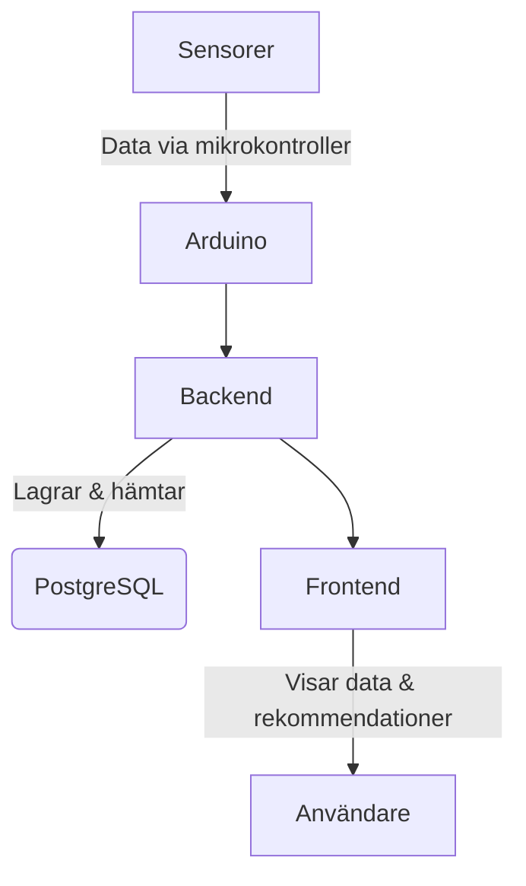

# Odlingskollen – Smart övervakning för ett friskare jordbruk

**Odlingskollen** är ett IoT-baserat system som ger växtodlare realtidsinsikter om jordens skick direkt i mobilen. Genom att mäta fuktighet, solljus, temperatur och nederbörd kan användaren fatta bättre beslut kring bevattning och växtvård. Systemet kombinerar sensorteknik, backend och mobilapp till en komplett lösning.

Detta projekt har utvecklats som en del av *Chas Challenge*, där vi i tre tvärfunktionella team, IoT, backend och frontend, har samarbetat för att skapa en fungerande produkt med verkligt värde.

---

## Vad är syftet?

- Hjälpa odlare att spara vatten och resurser genom datadrivna beslut
- Minska svinn och öka skördens kvalitet
- Ge tydlig, visuell feedback om markförhållanden
- Automatisera manuell övervakning av växtmiljöer

---

## Funktioner

- Visar aktuell jordfuktighet, temperatur och ljusnivå  
- Varnar vid avvikande värden (t.ex. torr jord, hög temperatur)  
- Möjlighet att lägga till, ta bort och namnge växter  
- Säker inloggning via Supabase  
- Mobilgränssnitt med realtidsuppdatering  

---

## Målgrupp

**Odlingskollen** riktar sig främst till:

- Bönder och växtodlare som vill effektivisera sin bevattning och övervakning
- Kommersiella växthus och inomhusodlingar
- Hobbyodlare med intresse för teknik och data
- Kontorsmiljöer med växtsystem som kräver noggrann skötsel

Systemet är tänkt att vara både användarvänligt och skalbart. Från mindre planteringar till större odlingsanläggningar.

---

## Använd teknik

| Del | Teknik |
|-----|--------|
| **Frontend** | React Native, JavaScript, CSS |
| **Backend**  | Node.js, Express.js, Supabase (PostgreSQL) |
| **IoT**      | Arduino, C++ (PlatformIO), sensorer för fukt, ljus, temperatur |

---

## Arkitekturöversikt

## Projektteam

### **Frontend**
- Amanda Lindström  
- Sandra Karlberg  

### **Backend**
- Jonatan Jarl  
- Filip Wretner  
- Andreas  
- David  
- Gaston  

### **IoT**
- Jonathan Rubin  
- Dennis Holm  
- Jessica Sjösten  
- Seref Özbodur  
- Erik Eriksson  

---

## Testning

- Manuell testning av sensorer i varierande miljöer  
- Figma-användartester för mobilappens gränssnitt  
- Integrationstest mellan IoT och backend  
- Kodgranskning via pull requests  

---

## Utmaningar vi mötte

- Sen leverans av hårdvarukomponenter
- Trasiga eller felkalibrerade sensorer 
- Koordination mellan tre utvecklingsteam  
- Tidspress och olika arbetsstilar  

---

## Vad vi lärt oss

- Vikten av kontinuerlig kommunikation i team med olika roller  
- Hur man bygger en produkt från sensor till användargränssnitt  
- Hur verkliga användarbehov styr funktioner  
- Mer om databaser, API-struktur och mobil design  

---

## Resultat

- Ett fungerande system som mäter och skickar jorddata  
- En mobilapp där användaren kan följa sina växters status  
- En backend och databas som kopplar ihop allt  
- Tydlig dokumentation och en pipeline för fortsatt utveckling  

---

## Slutord

**Odlingskollen** är mer än bara ett studentprojekt, det är ett konkret exempel på hur teknik kan användas för att lösa verkliga problem. Vi har samarbetat mellan frontend, backend och IoT, testat våra idéer i praktiken och byggt något vi är stolta över.

---

## Screenshots

***Här kanske vi kan stoppa in lite screen shots från när appen används***
